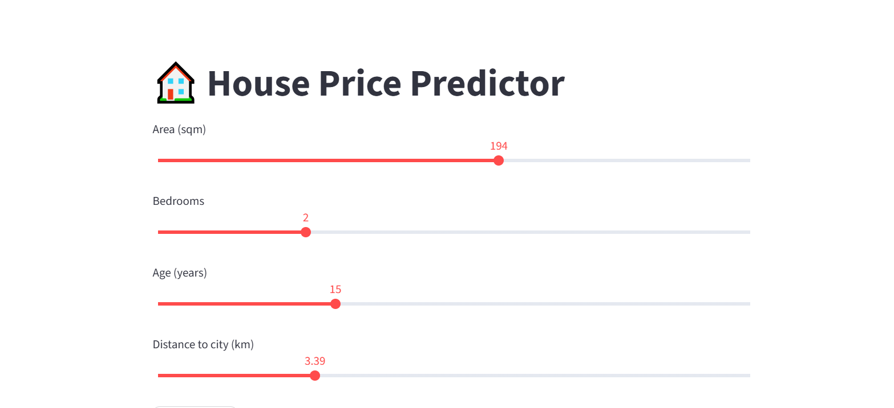
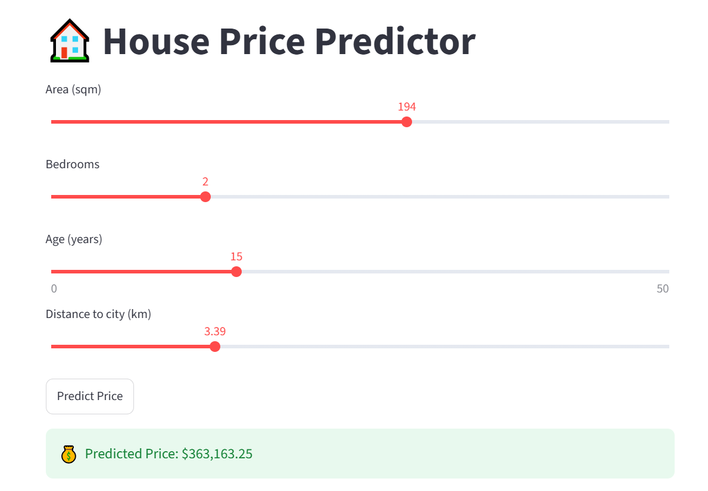
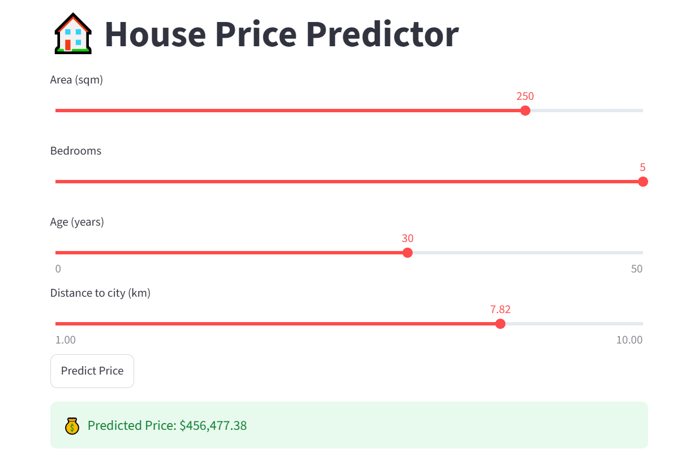
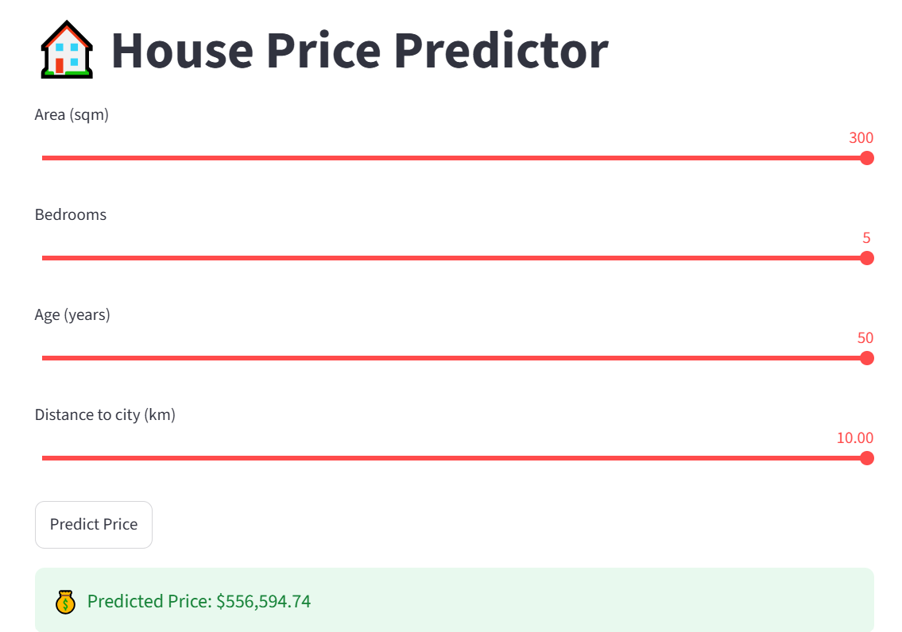

# 🏠 House Price Predictor

A complete end-to-end **Machine Learning** project that predicts house prices using a **Random Forest Regressor**, served through a **FastAPI** REST API and an interactive **Streamlit** web app.


---

## 📌 Overview

This project simulates a real estate dataset, trains a regression model to predict house prices based on key property features, and exposes the model through two interfaces:

- ⚙️ A **REST API** (FastAPI) for programmatic predictions
- 🖥️ A **Web UI** (Streamlit) for interactive, slider-based predictions

It demonstrates a complete ML workflow — from **data generation** to **model training**, **evaluation**, and **deployment**.

---

## ✨ Features

- 📊 Synthetic housing dataset generation with realistic pricing logic
- 🌲 Random Forest Regression model for price prediction
- 🚀 FastAPI backend with a `/predict` endpoint
- 🎛️ Interactive Streamlit UI with sliders for live predictions
- 📈 Model evaluation using R² Score and RMSE
- 💾 Model persistence with `joblib`

---

## 🖼️ Demo Screenshots

<table>
  <tr>
    <td align="center"><b>App Home</b></td>
    <td align="center"><b>Prediction Result</b></td>
  </tr>
  <tr>
    <td></td>
    <td></td>
  </tr>
  <tr>
    <td align="center"><b>Custom Input Example</b></td>
    <td align="center"><b>Max Values Example</b></td>
  </tr>
  <tr>
    <td></td>
    <td></td>
  </tr>
</table>

---

## 🛠️ Tech Stack

| Category            | Technology              |
|---------------------|--------------------------|
| Language             | Python 3.10              |
| Data Handling        | Pandas, NumPy            |
| Machine Learning      | scikit-learn (Random Forest Regressor) |
| Model Persistence    | Joblib                   |
| API Framework        | FastAPI                  |
| Web UI                | Streamlit                |
| Validation            | Pydantic                 |

---

## 📁 Project Structure

```
house-price-predictor/
│
├── generate_data.py         # Generates the synthetic housing dataset
├── train_model.py           # Trains and saves the Random Forest model
├── api.py                   # FastAPI backend serving predictions
├── ui.py                    # Streamlit web app for interactive predictions
├── housing.csv               # Generated dataset
├── house_price_model.pkl     # Trained ML model (serialized)
├── test_api.py                # Basic API tests (pytest)
├── requirements.txt          # Project dependencies
├── screenshots/               # UI demo screenshots
├── .github/workflows/ci.yml   # GitHub Actions CI pipeline
├── .gitignore
├── CONTRIBUTING.md
├── LICENSE
└── README.md
```

---

## ⚙️ Installation & Setup

### 1. Clone the repository
```bash
git clone https://github.com/<your-username>/house-price-predictor.git
cd house-price-predictor
```

### 2. Create a virtual environment (recommended)
```bash
python -m venv venv
source venv/bin/activate      # On Windows: venv\Scripts\activate
```

### 3. Install dependencies
```bash
pip install -r requirements.txt
```

---

## 🚀 Usage

### Step 1 — Generate the dataset
```bash
python generate_data.py
```
This creates `housing.csv` with 1,000 synthetic housing records.

### Step 2 — Train the model
```bash
python train_model.py
```
This trains a Random Forest Regressor and saves it as `house_price_model.pkl`.

### Step 3 — Run the API
```bash
uvicorn api:app --reload
```
The API will be available at: `http://127.0.0.1:8000`
Interactive API docs (Swagger UI): `http://127.0.0.1:8000/docs`

### Step 4 — Run the Web UI
```bash
streamlit run ui.py
```
The app will open in your browser at: `http://localhost:8501`

---

## 📡 API Reference

**Endpoint:** `POST /predict`

**Request Body:**
```json
{
  "area": 194,
  "bedrooms": 2,
  "age": 15,
  "proximity": 3.39
}
```

**Response:**
```json
{
  "predicted_price": 363163.25
}
```

| Field       | Type    | Description                          |
|-------------|---------|---------------------------------------|
| `area`      | float   | Area of the house in square meters    |
| `bedrooms`  | int     | Number of bedrooms                    |
| `age`       | int     | Age of the property in years          |
| `proximity` | float   | Distance to city center in kilometers |

---

## 📊 Model Performance

The Random Forest Regressor was evaluated on a held-out 20% test split:

| Metric       | Score      |
|--------------|------------|
| R² Score     | 0.981      |
| RMSE         | ≈ 20,807   |

A high R² score indicates the model explains the vast majority of the variance in house prices based on the given features.

---

## ✅ Testing

Basic API tests are included in `test_api.py`, covering the root endpoint, a valid prediction request, and invalid input handling.

```bash
pip install pytest httpx
pytest test_api.py -v
```

## 🔄 Continuous Integration

This repo includes a GitHub Actions workflow (`.github/workflows/ci.yml`) that automatically:
- Installs dependencies
- Generates the dataset
- Trains the model
- Runs the test suite

on every push and pull request to `main`.

## 🔮 Future Improvements

- Add more real-world features (location, amenities, condition score)
- Deploy the API on a cloud platform (Render, Railway, AWS)
- Add unit tests for the API endpoints
- Containerize the project using Docker
- Add a database layer to store prediction history

---

## 👩‍💻 Author

**Faiza Shaukat**
BS Artificial Intelligence, University of Haripur

---

## 📄 License

This project is licensed under the [MIT License](LICENSE).
